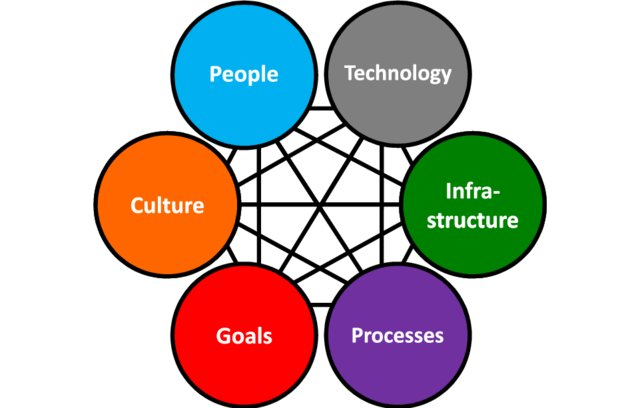

# Welcome to the Spyderisk Open Project on GitHub

Complex socio-technical computer systems are too vast and intricate for any
human to understand. In a large airport, or a global social networking app, or
many other modern system there is a lot more than just technology involved, as
illustrated here:

 [1]

Each of these influences are constantly changing, and are complex systems in
their own right. How can anyone predict if such a system can be trusted, or
what its effects could be on our daily lives?  Society is rightly concerned,
and Spyderisk is our response to this concern.

The [Spyderisk Open Project Strategy](https://github.com/Spyderisk/system-modeller/blob/dev/docs/Spyderisk-Open-Project-Strategy.md) explains our aim to:

> Revolutionise understanding of the trustworthiness of socio-technical systems
> by establishing an international Open Community supporting the research,
> development, use and support of open, effective, and accessible risk
> assessment methods, knowledge and tools.

The Spyderisk Open Project started in 2023, building on
[15 years of history in risk assessment](https://github.com/Spyderisk/system-modeller/blob/dev/HISTORY.md).

All our work is published and maintained under open licenses - software
source code, ontologies, domain model database, online training, documentation,
and academic papers. The Spyderisk Open Project was founded by the University
of Southampton in England, but we welcome all collaborators and contributors. You
can contact us via the [spyderisk-dev](https://www.jiscmail.ac.uk/cgi-bin/webadmin?A0=SPYDERISK-DEV)list.

## Who is Spyderisk for?

Spyderisk at present in 2024 is for people who are familiar with the field of risk
assessment, such as risk researchers, academics, ethicists or policymakers.

The Spyderisk Open Project focusses on:

* the ethics of risk assessment
* ontologies of harm, risk and misbehaviour
* mathematical modelling of risk assessment
* software tools to calculate risk in models of complex systems

While the Spyderisk software currently takes some technical knowledge to run,
but as we make clear in our [guide for Spyderisk System Modeller
contributors](https://github.com/Spyderisk/system-modeller/blob/dev/CONTRIBUTING.md)
anyone passionate about risk assessment can likely find a way to get involved.
Even explaining what risk assessment is about is a skill, and if you have that
skill we would love to hear from you.

Our introductory online course 
[Cybersecurity Risk Assessment & Modelling: Core Priniciples](https://training.spyderisk.org/courses/course/view.php?id=2)
is a good place to start for those who are not already in the field of risk assessment. 

## What is Spyderisk?

Spyderisk is for assessing risk in complex socio-technical systems. By *complex systems* we
mean "systems of systems that humans are unable to fully understand, debug or
predict, typically socio-technical-physical systems." In other words, humans
build critical systems that are unknowable, and so we need to apply mathematics
to delineate the risks in these unknowable systems.

"Socio-technical" relates to the interconnectedness of the modern world.
*Social* aspects include legal and policy requirements and aspects of human
psychology while *technical* components include information technology networks
and machine learning/artificial intelligence. This also includes physical
systems such as handheld devices, train station information zones, and human
guards at country frontier checkpoints. Put together, these kinds of complex
systems decide our everyday privacy, the safety of our medical records, and
that airports function smoothly and safely.

The Spyderisk team has written many
[papers and reports related to risk assessment](https://github.com/Spyderisk/system-modeller/blob/dev/docs/papers/README.md),
including some of the first on ontological approaches to concepts such as biomedical burden
and cybersecurity aspects of systems composed of IoT systems. Spyderisk starts from an
[ontological approach](https://github.com/Spyderisk/system-modeller/blob/dev/docs/ontology.md)
although end users of the Spyderisk software do not require an understanding of ontology.

As of Mid-2024, the Spyderisk software is in early release, fully available but only working
in quite specific circumstances. To get a feel for what the software can do once it is running,
the course [Getting Hands on with Spyderisk](https://training.spyderisk.org/courses/course/view.php?id=3) explains
how to model systems using the Spyderisk software.

If you are a researcher in the area of risk modelling including ontologies of
risk, or if you have a specific problem domain you need to examine
(particularly in cybersecurity or privacy) then you are already part of our
community and Spyderisk could be for you. 

# The Spyderisk GitHub repositories

There are many repositories, of which the central four are:

* [Spyderisk System Modeller](https://github.com/Spyderisk/system-modeller) - the web service software, for people comfortable dealing with computer source code
* [Spyderisk System Modeller Deployment](https://github.com/Spyderisk/system-modeller-deployment/) - the tools which allow a user familiar with installing software to get Spyderisk running, either on their own laptop or on cloud servers they own.
* [Spyderisk Adaptor](https://github.com/Spyderisk/system-modeller-adaptor/) - for users of the [Python programming language](https://python.org) commonly used in science and academia, who want to do automated risk assessment using the Spyderisk reasoner but from their own code. A running instance of the Spyderisk application has APIs that the Spyderisk Adaptor calls.
* [Spyderisk Domain Network](https://github.com/Spyderisk/domain-network) - the most complete and advanced Spyderisk knowledgebase, describing a complex computing/IoT/cloud network in very general terms such as "server computer" or "database". Users of the Spyderisk software can then load in this model and use it as a palette for drawing their own real-world network in order to explore their particular risk profiles.

Other repositories vary from project administration tools to very specific
technical code that operates on Domain Models.

We look forward to seeing you around the risk assessment community.

[1] Image copyright CC-BY-4.0, Heriot-Watt University, A method for predicting malfunctions in socio-Technical systems, DOI 10.1017/dsj.2017.4
